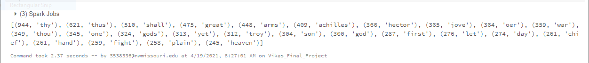
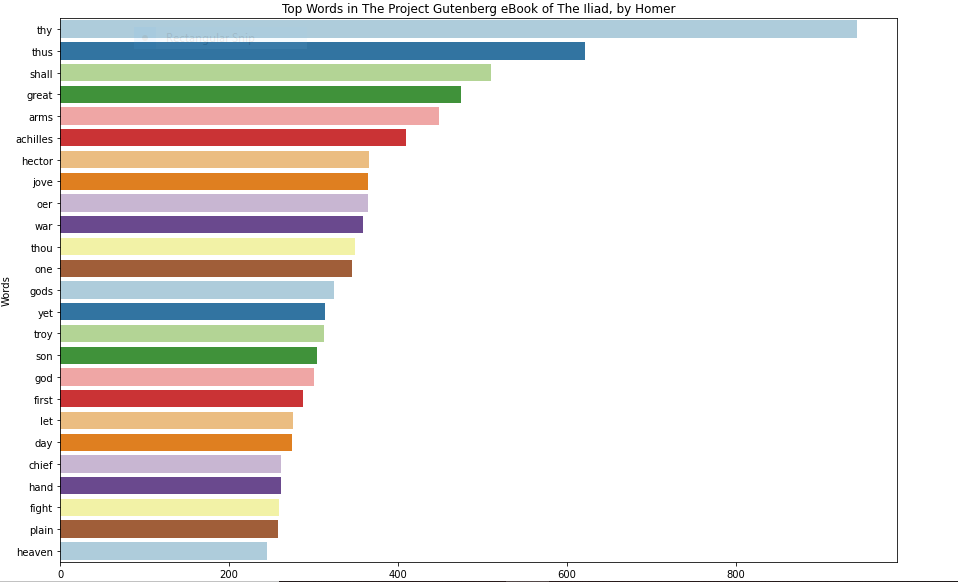

# BigData Final Project

This repositorycontains the commands and a notebook about processing text data using Spark and Python.

## Author:

- [Vikas Baswapuram](https://github.com/Vikas2004)

## Resource for Text Data:

- [The Project Gutenberg eBook of The Iliad, by Homer](https://www.gutenberg.org/files/6130/6130-0.txt)

## Tools and Languages:
- Databricks Cloud Environment.
- Spark Processing Engine.
- PySpark.
- Python Programming Language.

## Published Link of the Notebook used in Databricks:

The Link can be found [here.](https://databricks-prod-cloudfront.cloud.databricks.com/public/4027ec902e239c93eaaa8714f173bcfc/5182287336224484/1917500454129484/5845031339478918/latest.html)

## Commands used:

- The import urllib.request library is used to import the data directly form the URL.
- I have used the above library to import the data into a temporary folder from the url which is shown below.

### Processing the Data:

```
import urllib.request
stringInURL = "https://www.gutenberg.org/files/6130/6130-0.txt"
urllib.request.urlretrieve(stringInURL, "/tmp/finaProject_data.txt")
```

- The data saved in the temp folder is moved to the data folder of dbfs.
- We'll use dbutils.fs.mv to transfer the data.

```
dbutils.fs.mv("file:/tmp/finaProject_data.txt", "dbfs:/data/finaProject_data.txt")
```

- Transferring the file into Spark. Spark stores information in RDDs(Resilient Distributed Datasets). 
- This indiactes our next step, converting our data into an RDD.
- sc in Databricks is used to perform the above task.

```
final_RDD = sc.textFile("dbfs:/data/finaProject_data.txt")
```

### Cleaning the Data:

- Stopwords are simply words that improve the flow of a sentence without adding something to it.
- We are trying to split the words and converting them to lower case.

```
textRDD = final_RDD.flatMap(lambda line : line.lower().strip().split(" "))
```

- The punctuation will now be removed using the following commands.
- We now delete the stopwords as words are now actually words.
- PySpark identifies which words are stopwords, we just need to import the StopWordsRemover library from pyspark which we use to filter them.
- Removing any empty elements that resembles an empty element.

```
# map() words to (words,1) intermediate key-value pairs.
import re
# removing punctutations.
cleanToken_RDD = textRDD.map(lambda words: re.sub(r'[^a-zA-Z]','',words))
#prepare to clean stopwords
from pyspark.ml.feature import StopWordsRemover
remove =StopWordsRemover()
stopWords = remove.getStopWords()
cleanData_RDD=cleanToken_RDD.filter(lambda wrds: wrds not in stopWords)
# Removing the spaces/emptywords
Final_clean_DataRDD = cleanData_RDD.filter(lambda x: x != "")
#maps the words to key value pairs
IKVPairsRDD= Final_clean_DataRDD.map(lambda word: (word,1))

```

- Converting the keyvalue pairs to word count.

```
Final_word_count_RDD = IKVPairsRDD.reduceByKey(lambda acc, value: acc+value)
```
- Sorting the words in the descending order and printing the results to check the first 25 results in descending order.

```
final_results = Final_word_count_RDD.map(lambda x: (x[1], x[0])).sortByKey(False).take(25)
print(final_results)
```
- collect() action to get back to python

```
results = Final_word_count_RDD.collect()
print(results)
```
## Charting the results:

- We use pandas, matplotlib seaborn to chart the results.

```
import numpy as np
import pandas as pd
import matplotlib.pyplot as plt
import seaborn as sns
from collections import Counter

source = 'The Project Gutenberg eBook of The Iliad, by Homer'
title = 'Top Words in ' + source
xlabel = 'Count'
ylabel = 'Words'

# create Pandas dataframe from list of tuples
df = pd.DataFrame.from_records(final_results, columns =[xlabel, ylabel]) 
print(df)

# create plot (using matplotlib)
plt.figure(figsize=(15,15))
sns.barplot(xlabel, ylabel, data=df, palette="Paired").set_title(title)
```

## Results:






- I ahve displayed thetop 25 words in the above chart.


## References:

- https://www.w3schools.com/python/python_lambda.asp
- https://databricks-prod-cloudfront.cloud.databricks.com/public/4027ec902e239c93eaaa8714f173bcfc/3328674740105987/4033840715400609/6441317451288404/latest.html
